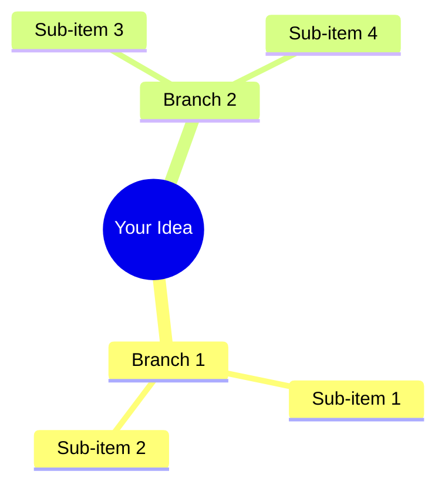

# Mermaid Copilot

A lightweight, AI-powered diagram editor with zero build steps and no heavy frameworks. Pure HTML, CSS, and vanilla JavaScript.

## Features

- 🎨 **Dual Rendering System** - Mermaid.js for standard diagrams, custom D3.js for mindmaps
- 🤖 **AI Chat Interface** - Generate and update diagrams through natural language
- 🎯 **Custom Mindmap Renderer** - Beautiful aligned boxes with elbowed connectors
- 🌈 **14 Built-in Themes** - From dark mode to cyberpunk
- 📤 **Multiple Export Formats** - SVG, PNG, and Mermaid (.mmd) files
- 🎤 **Voice Input** - Speak your diagram ideas
- 🔍 **Zoom & Pan** - Smooth navigation for large diagrams

## Zero Dependencies Philosophy

**No Node.js required. No npm. No build process. No webpack. No bundlers.**

Just open `index.html` in your browser and start creating diagrams.

The only runtime dependencies are loaded from CDN:
- Mermaid.js for diagram rendering
- D3.js for custom mindmap visualization

## Quick Start

1. Clone the repository:
```bash
git clone <repository-url>
cd mermaid-agent
```

2. Open in your browser:
```bash
# Using Python
python3 -m http.server 8080

# Or using any static file server
# Or simply open index.html directly
```

3. Add your OpenAI API key in Settings

## Project Structure

```
mermaid-agent/
├── index.html           # Single HTML entry point
├── styles.css           # All styling, no preprocessors
├── src/
│   ├── app.js          # Main application logic
│   ├── mermaid.js      # Mermaid integration
│   ├── mindmap-renderer.js  # Custom D3 mindmap
│   ├── provider.js     # AI provider interface
│   └── speech.js       # Voice input handling
└── README.md
```

## Supported Diagrams

### Standard Mermaid Diagrams
- Flowcharts
- Sequence diagrams
- Gantt charts
- Class diagrams
- State diagrams
- Entity relationship diagrams
- User journey maps
- Git graphs
- Pie charts

### Custom Mindmap (Enhanced)


## Customization

### Adding Themes
Edit the theme presets in `app.js`:
```javascript
const presets = {
  yourTheme: { 
    theme: 'dark', 
    themeVariables: { 
      primaryColor: '#...', 
      // ...
    }
  }
};
```

### Modifying AI Prompts
Update the system prompt in `provider.js` to customize diagram generation behavior.

## Browser Support

Works in all modern browsers with ES6 support:
- Chrome/Edge 88+
- Firefox 78+
- Safari 14+

## Philosophy

This project proves you don't need complex build systems or heavy frameworks to create powerful web applications. With modern browser APIs and a few carefully chosen libraries loaded from CDN, you can build sophisticated tools that are:

- **Fast** - No bundling overhead
- **Simple** - Direct file editing, instant refresh
- **Debuggable** - Source maps not needed, code is the source
- **Portable** - Works anywhere a browser runs
- **Maintainable** - Clear file structure, no magic

## License

MIT

## Contributing

Keep it simple. If it requires a build step, it doesn't belong here.

---

*Built with vanilla JavaScript and a focus on simplicity.*